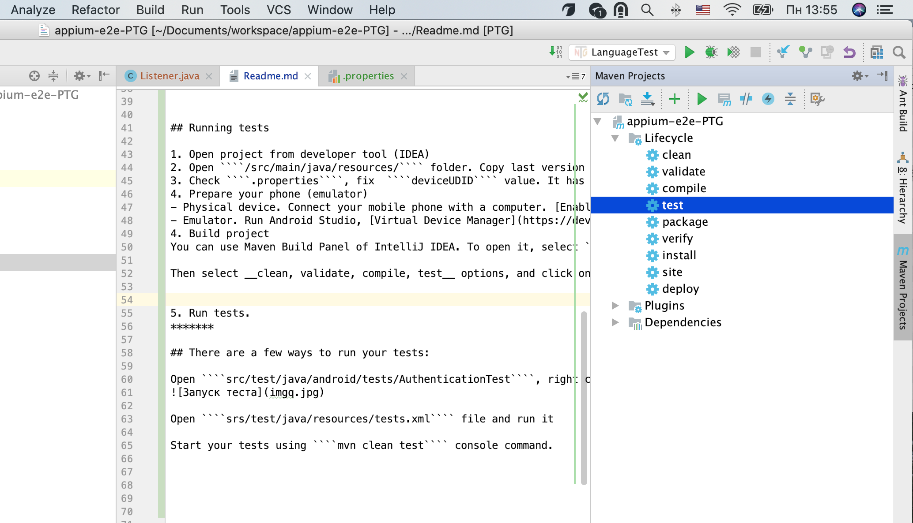

***
# Appium + Maven + Java project for automated testing Telegram - Partisan (PTG)
***

## Installing step-by-step instruction:

#### Step One:
1. [Maven](https://maven.apache.org/download.cgi "Maven downloads") is a Java tool, so you must have [Java](https://www.oracle.com/java/technologies/downloads/ "Java downloads") installed in order to proceed.
2. Getting started with [Appium](https://appium.io/docs/en/about-appium/getting-started/?lang=en#getting-started)
3. You can use some of developer tools, for ex  [InteliJ IDEA](https://www.jetbrains.com/idea/download)
4. If you want to use android emulator to running tests you should install any instrument, for ex [Android Studio](https://developer.android.com/studio)

You can use [Brew](https://brew.sh/) for installations on Mac.
````
brew install node
brew install maven
sudo npm i -g appium (or exact version: sudo npm i -g appium@1.22.3)
````

#### Step Two:
Open list of your environment variables on your computer (.bash or .zshrc)
There's you should have JAVA_HOME and ANDROID_HOME variables.

````
export JAVA_HOME=/Library/Java/JavaVirtualMachines/jdk-19.jdk/Contents/Home
export ANDROID_HOME=$HOME/Library/Android/sdk
export PATH=${PATH}:$ANDROID_HOME/tools:$ANDROID_HOME/platform-tools
export M2_HOME="$HOME/apache-maven-3.8.7"
PATH="${M2_HOME}/bin:${PATH}"
export PATH
````

## Run Appium Server and Appium Inspector locally
1. Install [Appium Server](https://github.com/appium/appium-desktop)
Run with settings
````
host: localhost
port: 4723
````
2. Please install [Appium Inspector](https://github.com/appium/appium-inspector#installation). Appium Inspector is basically just an Appium client (like WebdriverIO, Appium's Java client, etc...) with a user interface.
Run with settings
````
Remote Host: localhost
Remote Path: /wd/hub
````
Desired capabilities for android:
````
{
  "platformName": "Android",
  "app": "/Users/{your_value}/desktop/app.apk",
  "udid": "{your_udid}"
}
````


## Running tests from project

#### Clone project
1. Sign up [GitHub](https://github.com/login) account
2. Clone project
````
git clone https://github.com/groznyj1530/appium-e2e-PTG.git
````

#### Run tests
1. Open project from developer tool (IDEA)
2. Open ````/src/main/java/resources/```` folder. Copy last version of application ````app.apk````  here.
3. Check ````.properties````, fix  ````deviceUDID```` value. It has to match udid of your phone (emulator).
4. Prepare your phone (emulator)
- Physical device. Connect your mobile phone with a computer. [Enable Developer options](https://developer.android.com/studio/debug/dev-options) on the device.
- Emulator. Run Android Studio, [Virtual Device Manager](https://developer.android.com/studio/run/managing-avds). Install any emulator, run it.
5. Build project
You can use Maven Build Panel of IntelliJ IDEA. To open it, select ````View -> Tool Windows -> Maven```` in Mac Menu Bar.
Then select __clean, validate, compile, test__ options, and click on __Run Maven Build__ button


5. Run tests
*******
##### There are a few ways to run your tests:

Open ````src/test/java/android/tests/AuthenticationTest````, right click, Run AuthenticationTest

Open ````srs/test/java/resources/testng.xml```` file and run it

Start your tests using ````mvn clean test```` console command.

#### AuthenticationTest
1. Change your code and phone in  ````srs/test/java/android/data/User````
2. Run AuthenticationTest firstly ````srs/test/java/android/tests/AuthenticationTest````. Put code manually during test. Agree with permissions manually.


